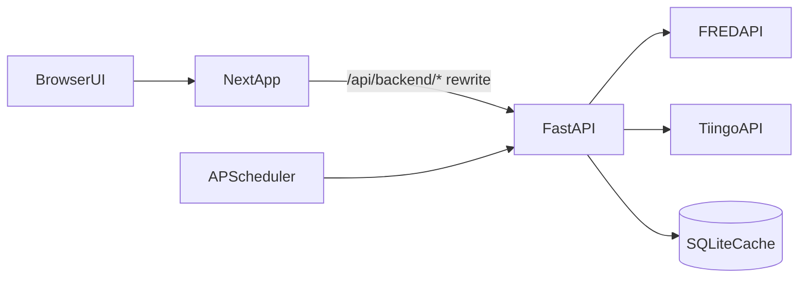
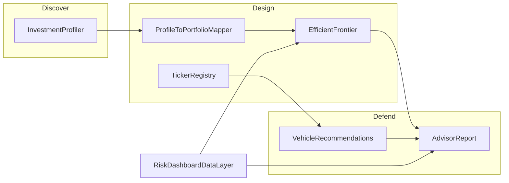

# Architecture

## Purpose
This document explains how the Risk Dashboard is structured today, how data flows through the system, and where to focus when extending or stabilizing the app.

## System Boundaries
- Frontend: Next.js app in `frontend/` (App Router), data fetching with TanStack Query.
- Backend: FastAPI app in `backend/` exposing `/api/v1/*` endpoints.
- Data providers: FRED (macro/rates series) and Tiingo (market proxy prices via ETF tickers).
- Storage: SQLite database in `backend/data/risk_dashboard.db`.
- Orchestration: `docker-compose.yml` runs frontend and backend together.

## Runtime Topology

## Core Request Flows

### Dashboard data read path
1. User opens a route such as `/` (overview), `/equities`, or `/credit` in the frontend.
2. Overview uses server-prefetch (`frontend/app/page.tsx` → `OverviewPage.tsx`) with `include_history=false` for metrics-only payloads.
3. Other routes use TanStack Query hooks requesting backend metrics endpoints (`/api/v1/equities/*`, etc.).
4. Backend services compute metrics from cached series/tickers (refreshing/falling back as needed).
5. Backend responds with `AssetClassMetrics`, including summary metrics and optional chart history.
6. Frontend renders cards/charts; route `loading.tsx` skeletons show during navigation.

### Data refresh path
1. Frontend or operator calls `POST /api/v1/data-status/refresh`.
2. Backend schedules `refresh_all_data` as a background task.
3. Fetchers update cached data and write refresh status rows.
4. `GET /api/v1/data-status` reflects per-series status and overall health.

### Portfolio optimizer path
1. User opens `/portfolio` — bare page shows sliders/chart shell with no API call until **Run Optimizer** is clicked.
2. With a client portfolio selected or `?prefill=1`, weights load from saved profile and frontier auto-runs.
3. Frontend posts `FrontierComputeRequest` (`weights` + optional `suggested_weights`) to `POST /api/v1/portfolio/frontier`.
4. Backend loads available ticker history, computes expected returns via `expected_returns.py`, then frontier/points.
5. Response includes frontier curve, max Sharpe, min vol, current allocation point, optional suggested point, and correlation matrix.

### Client workspace path
1. Advisor creates/manages clients at `/clients` via `GET/POST /api/v1/clients`.
2. Profiler save persists profile to client or portfolio via `/profiles` endpoints.
3. Portfolios and outlines version weight proposals under `/portfolios` and `/outlines`.
4. Portfolio page loads client weights through `PortfolioSelector` and maps profile scores via `mapProfileToPortfolioWeights`.

## Backend Structure
- Entry point: `backend/app/main.py`
- API router: `backend/app/api/v1/router.py`
- Endpoint groups:
  - `backend/app/api/v1/endpoints/equities.py`
  - `backend/app/api/v1/endpoints/credit.py`
  - `backend/app/api/v1/endpoints/hard_assets.py`
  - `backend/app/api/v1/endpoints/cash.py`
  - `backend/app/api/v1/endpoints/portfolio.py`
  - `backend/app/api/v1/endpoints/data_status.py`
  - `backend/app/api/v1/endpoints/tickers.py`
  - `backend/app/api/v1/endpoints/clients.py`
- Shared schemas: `backend/app/models/schemas.py`
- Data fetch/cache layer: `backend/app/services/data_fetchers/`
  - Request-scoped memoization via `cache.py` + `RequestCacheMiddleware` in `main.py`
  - Response cache (10-min TTL) via `response_cache.py` on aggregate `/all` endpoints
  - Incremental upserts in `series_store.py`; parallel refresh in `data_manager.py`
- Observability: `TimingMiddleware` in `main.py` logs duration and sets `X-Response-Time` header
- Shared expected returns: `backend/app/services/risk/expected_returns.py`
- Client workspace: `backend/app/services/clients/workspace.py`
- Risk engine: `backend/app/services/risk/`
- Asset logic: `backend/app/services/asset_classes/` (shared pipeline in `base.py`)

## Frontend Structure
- App routes: `frontend/app/` (with per-route `loading.tsx` skeletons)
- Shell: `frontend/app/layout.tsx` wraps children in `ClientShell` (nav, query provider, data-status bar)
- Overview: server-prefetch in `page.tsx`, client render in `OverviewPage.tsx`
- Shared API client: `frontend/lib/api/` (including `dataStatus.ts`, `server.ts` for SSR fetch)
- Query hooks: `frontend/hooks/` (including `useAdvisorReport.ts` for profiler summary)
- Lazy charts: `frontend/components/charts/lazyCharts.tsx`, `lazyDashboard.tsx`
- UI components:
  - Dashboard cards/charts: `frontend/components/dashboard/`, `frontend/components/charts/`
  - Portfolio UI: `frontend/components/portfolio/` (`PortfolioSelector`, `PortfolioComparisonPanel`, `FrontierControls`)
  - Layout/nav/status: `frontend/components/layout/`
  - Finesse practice UI: `frontend/components/finesse/`
  - Profiler/advisor: `frontend/components/profiler/`

## Advisory Practice (Phase 2)

Finesse Funds extends the macro dashboard into a client portfolio workflow:

**Discover:** 12-question profiler (Growth / Income / Safety triangle + aggression dial + governor cap).

**Design:** Map profile to `PortfolioWeights`, analyze with live market assumptions; custom tickers (e.g. JEPI) stored in `custom_tickers` with primary objective + optional G/I/S weights.

**Defend:** Advisor report with allocation rationale, vehicle suggestions, and market callouts.

Key insight: **objective orientation** (G/I/S) and **risk tolerance** (aggression) are separate — a client may tolerate equity volatility but prioritize income (JEPI-style vehicles).

## Operational Assumptions (Current)
- Keys required for meaningful data: `FRED_API_KEY`, `TIINGO_API_KEY`.
- First-run data refresh is required before most metrics are meaningful.
- Dockerfiles include `production` stages but `docker-compose.yml` defaults to `development` targets (see `KNOWN_GAPS.md` #3).
- SQLite is sufficient for local/prototype usage; multi-instance production use needs stronger persistence strategy.

## Known Design Risks
- Dev-oriented Docker/runtime defaults (see `KNOWN_GAPS.md` #3).
- Expected return inputs include hardcoded assumptions (see `KNOWN_GAPS.md` #5).
- Custom tickers are not yet in the efficient frontier optimizer (registry is for vehicles/recommendations v1; see `KNOWN_GAPS.md` #8).
- Clients/profiler/tickers surfaces lack integration test coverage (see `KNOWN_GAPS.md` #13).

## See Also
- Documentation entry: `docs/README.md`
- Build rules: `docs/DOC_RULES.md`
- Build sequence: `docs/BUILD.md`
- Setup details: `docs/modules/01_DOCKER_SETUP.md`
- Quant methodology: `docs/METHODOLOGY.md`
- Runbooks: `docs/RUNBOOKS.md`
- Known issues and limitations: `docs/KNOWN_GAPS.md`
- Delivery plan: `docs/ROADMAP.md`
