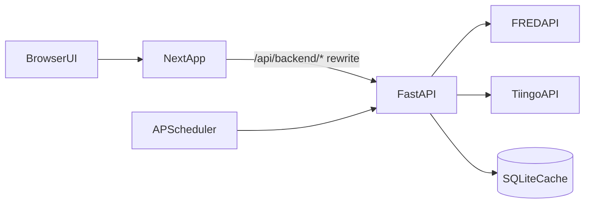
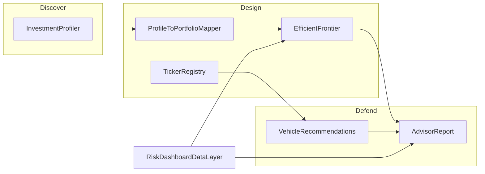

# Architecture

## Purpose
This document explains how the Risk Dashboard is structured today, how data flows through the system, and where to focus when extending or stabilizing the app.

## System Boundaries
- Frontend: Next.js app in `frontend/` (App Router), data fetching with TanStack Query.
- Backend: FastAPI app in `backend/` exposing `/api/v1/*` endpoints.
- Data providers: FRED (macro/rates series) and Tiingo (market proxy prices via ETF tickers).
- Storage: SQLite database in `backend/data/risk_dashboard.db`.
- Orchestration: `docker-compose.yml` runs frontend and backend together.

## Runtime Topology

## Core Request Flows

### Dashboard data read path
1. User opens a route such as `/equities` or `/credit` in the frontend.
2. Frontend hook requests backend metrics endpoint (`/api/v1/equities/*`, `/api/v1/credit/*`, etc.).
3. Backend services compute metrics from cached series/tickers (refreshing/falling back as needed).
4. Backend responds with `AssetClassMetrics`, including summary metrics and chart history.
5. Frontend renders cards/charts and reuses cache according to TanStack Query policy.

### Data refresh path
1. Frontend or operator calls `POST /api/v1/data-status/refresh`.
2. Backend schedules `refresh_all_data` as a background task.
3. Fetchers update cached data and write refresh status rows.
4. `GET /api/v1/data-status` reflects per-series status and overall health.

### Portfolio optimizer path
1. User adjusts weights on `/portfolio`.
2. Frontend posts weights to `POST /api/v1/portfolio/frontier`.
3. Backend loads available ticker history, computes expected returns/covariance, then frontier/points.
4. Response includes frontier curve, max Sharpe, min vol, current allocation point, and correlation matrix.

## Backend Structure
- Entry point: `backend/app/main.py`
- API router: `backend/app/api/v1/router.py`
- Endpoint groups:
  - `backend/app/api/v1/endpoints/equities.py`
  - `backend/app/api/v1/endpoints/credit.py`
  - `backend/app/api/v1/endpoints/hard_assets.py`
  - `backend/app/api/v1/endpoints/cash.py`
  - `backend/app/api/v1/endpoints/portfolio.py`
  - `backend/app/api/v1/endpoints/data_status.py`
  - `backend/app/api/v1/endpoints/tickers.py`
- Shared schemas: `backend/app/models/schemas.py`
- Data fetch/cache layer: `backend/app/services/data_fetchers/`
  - Request-scoped memoization via `RequestCacheMiddleware` in `main.py`
  - Shared expected returns: `backend/app/services/risk/expected_returns.py`
- Risk engine: `backend/app/services/risk/`
- Asset logic: `backend/app/services/asset_classes/` (shared pipeline in `base.py`)

## Frontend Structure
- App routes: `frontend/app/`
- Shared API client: `frontend/lib/api/`
- Query hooks: `frontend/hooks/`
- UI components:
  - Dashboard cards/charts: `frontend/components/dashboard/`, `frontend/components/charts/`
  - Portfolio UI: `frontend/components/portfolio/`
  - Layout/nav/status: `frontend/components/layout/`
  - Finesse practice UI: `frontend/components/finesse/`

## Advisory Practice (Phase 2)

Finesse Funds extends the macro dashboard into a client portfolio workflow:

**Discover:** 12-question profiler (Growth / Income / Safety triangle + aggression dial + governor cap).

**Design:** Map profile to `PortfolioWeights`, analyze with live market assumptions; custom tickers (e.g. JEPI) stored in `custom_tickers` with primary objective + optional G/I/S weights.

**Defend:** Advisor report with allocation rationale, vehicle suggestions, and market callouts.

Key insight: **objective orientation** (G/I/S) and **risk tolerance** (aggression) are separate — a client may tolerate equity volatility but prioritize income (JEPI-style vehicles).

## Operational Assumptions (Current)
- Keys required for meaningful data: `FRED_API_KEY`, `TIINGO_API_KEY`.
- First-run data refresh is required before most metrics are meaningful.
- Dockerfiles are currently dev-oriented (`npm run dev`, `uvicorn --reload`), not hardened production images.
- SQLite is sufficient for local/prototype usage; multi-instance production use needs stronger persistence strategy.

## Known Design Risks
- Dev-oriented Docker/runtime defaults (see `KNOWN_GAPS.md` #3).
- Expected return inputs include hardcoded assumptions (see `KNOWN_GAPS.md` #5).
- Custom tickers are not yet in the efficient frontier optimizer (registry is for vehicles/recommendations v1).

## See Also
- Documentation entry: `docs/README.md`
- Build rules: `docs/DOC_RULES.md`
- Build sequence: `docs/BUILD.md`
- Setup details: `docs/modules/01_DOCKER_SETUP.md`
- Quant methodology: `docs/METHODOLOGY.md`
- Runbooks: `docs/RUNBOOKS.md`
- Known issues and limitations: `docs/KNOWN_GAPS.md`
- Delivery plan: `docs/ROADMAP.md`
